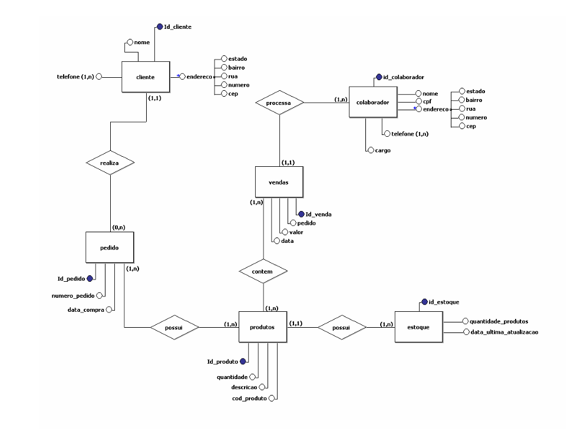
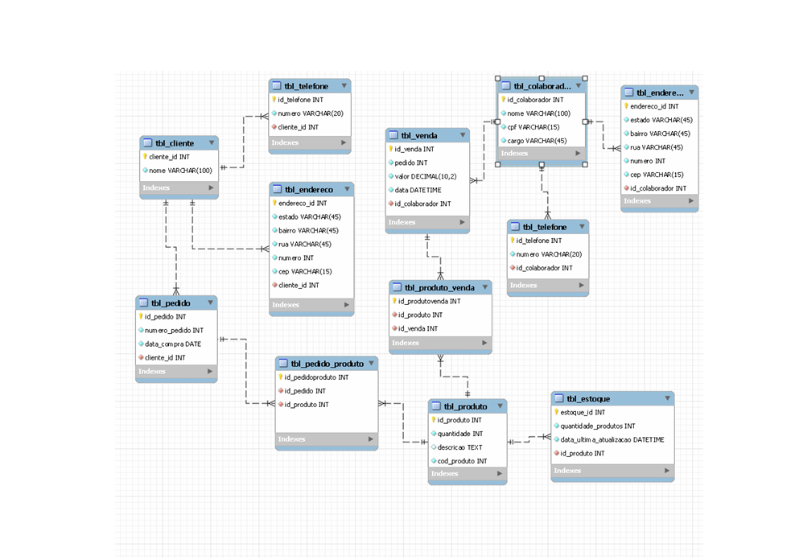

# supermercado-database
Modelagem de banco de dados de um sistema de supermercado (conceitual, lógico e físico).

## Sobre o projeto

Este repositório contém a estrutura de um banco de dados desenvolvida a partir das etapas de modelagem conceitual, lógica e física.

## Modelo conceitual

## Modelo lógico

## Modelo físico

O arquivo `schema.sql` contém o script SQL responsável por criar o banco de dados e todas as tabelas do sistema.

## Requisitos
MySQL
## Como executar
Execute o arquivo `schema.sql` no seu gerenciador MySQL.
